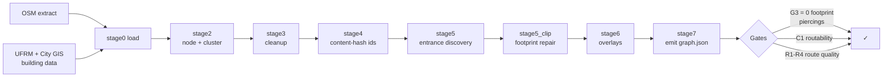

# Sun Walk

Pedestrian routing for the ASU Tempe campus, built around one problem general
maps don't solve: **campus maps route you to a building centroid and call it
done.** They can't tell a wheelchair user that the front door is three steps
up but the loading-dock entrance around the side is level. They can't tell
you a "connected" path is actually a flight of stairs. Sun Walk is a
from-scratch pedestrian graph designed so that entrance-level, accessibility-
aware routing is the point of the system — not a checkbox bolted on after
the fact.

**Live demo:** download [`docs/index.html`](./docs/index.html) and open it in
a browser — no server, no build step, no dependencies. It's a self-contained
snapshot of the current graph: every routable building, every path and
crossing, and a yellow pin on every building still waiting on an in-person
accessible-entrance survey.

## Why this is harder than it sounds

Off-the-shelf pedestrian data (OpenStreetMap, campus building lists) is
noisy in ways that quietly break routing:

- **Building footprints and entrances have to be found, not assumed.** A door
  is a real point on the building's boundary, found by matching OSM
  `entrance=*` tags, or by projecting outward from the footprint to the
  nearest walkway when no tag exists — never a straight line to the centroid.
- **Sidewalk data crosses buildings.** Any of those raw entrance links can
  end up geometrically punching through a building's own walls; a spatial
  gate (`G3`) rejects any build where that happens, and a repair stage
  re-routes the edge along the footprint's exterior instead.
- **Duplicate building codes are common** in the source data (the same code
  used for two physically separate wings) and silently merging them loses
  buildings — this project resolves ties deterministically instead.
- **Route quality is measured, not assumed.** Every build runs 500 seeded
  origin/destination pairs through the actual router and reports the detour
  ratio (routed distance ÷ straight-line distance) at the median and p90, so
  a bad noding decision shows up as a number, not a vibe.

## What's actually built

A SpatiaLite pipeline turns raw OSM + university facilities data into a
validated, routable graph:



- **Content-derived ids.** Node and edge ids are hashed from their endpoints,
  not assigned positionally — regenerating the graph never silently
  reassigns an id that an overlay or a saved route depends on.
- **A real router**, not a shortest-path demo: multi-source Dijkstra over a
  binary min-heap, seeded with every entrance of the origin and destination
  building at once, so "which door" is an output of the search rather than
  an assumption. Typed failure reasons (`no_entrance`, `disconnected`,
  `no_accessible_route`, …) instead of a silent `null`.
- **A three-tier data model** — immutable `sources/`, hand-authored
  `overlays/` for ground-truth corrections, and a generated, gitignored
  `build/` — so a graph rebuild never clobbers a manual correction and a
  manual correction never has to touch generated output.
- **Gate-driven validation**: structural schema checks, a spatial gate that
  asserts no walking edge cuts through a real building footprint, and a
  route-quality report over 500 seeded pairs, all wired into one command.

Current core build: **139/139 buildings routable**, 1,753 edges, 1,442
nodes, 0 footprint-piercing violations, one connected component.

## Tech stack

TypeScript (domain layer, strict mode, zero runtime UI dependencies) ·
Python + SQLite/SpatiaLite (the graph builder) · MapLibre GL (map rendering)
· Vite + React (app shell) · `node --test` and hand-rolled Python test
harnesses for the builder stages.

## Running it

```
npm install
npm run typecheck
npm test
npm run gates              # structural + spatial + route-quality validation
```

Building the graph requires a SpatiaLite-capable Python (the bundled
`mod_spatialite` extension isn't available on every default Python install —
see `contracts/authoring.sql` for the schema it bootstraps):

```
python scripts/build-graph.py --service-area sources/service-area-core.geojson
python scripts/second-light.py --no-serve     # regenerate the map viewer
```

## Project layout

```
src/domain/     TypeScript domain layer — router, store, geo math, types
scripts/build/  the 8-stage graph builder (Python + SpatiaLite)
scripts/        fetchers, validators, the route-quality report
contracts/      the authoring database schema + the runtime graph schema
docs/specs/     architecture, data-source, and validation-gate specs
sources/        immutable fetched data (OSM, ASU facilities, City of Tempe)
overlays/       hand-authored corrections, applied on top of every rebuild
```

See [`CONTRIBUTING.md`](./CONTRIBUTING.md) for the engineering rules this
project holds itself to.

## Data & licensing

The routable graph is derived from **OpenStreetMap** and is a Derivative
Database under the **Open Database License (ODbL 1.0)**. Full attribution is
in [`NOTICE`](./NOTICE):

> © OpenStreetMap contributors. Made available under the Open Database
> License: http://opendatacommons.org/licenses/odbl/1.0/

University building data (names, categories, footprints) comes from ASU's
public facilities records and City of Tempe open GIS, kept in separate files
under their own terms.
